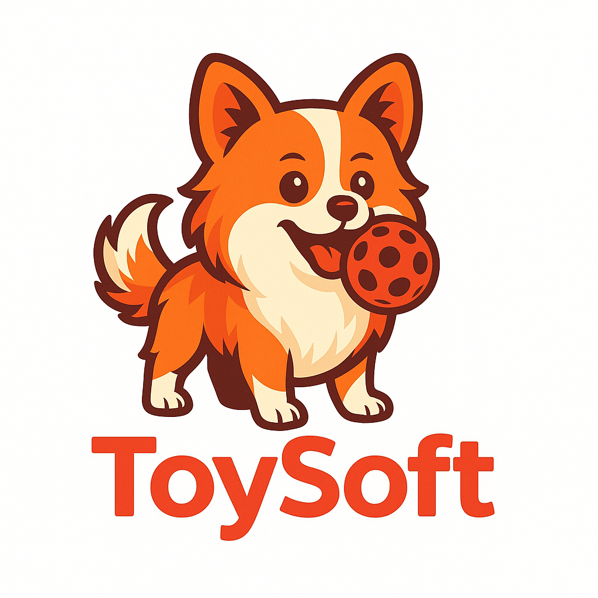

# Guía de Optimización del Logo - ToySoft POS

## Optimizaciones Implementadas

### 1. Preload del Logo Principal
- **Implementado**: `<link rel="preload" href="./image/logo-ToySoft.png" as="image" type="image/png">`
- **Beneficio**: El navegador descarga el logo inmediatamente, antes de que se necesite
- **Ubicación**: En el `<head>` de `index.html` y `admon.html`

### 2. Skeleton/Placeholder Animado
- **Implementado**: Animación de carga con gradiente que simula el logo
- **Beneficio**: Mejora la percepción de velocidad y evita el "flash" de contenido
- **Características**:
  - Animación suave de gradiente
  - Tamaño responsivo
  - Se oculta automáticamente cuando el logo carga

### 3. Lazy Loading para Logos Secundarios
- **Implementado**: `loading="lazy"` en logos de modales y elementos secundarios
- **Beneficio**: Los logos secundarios solo se cargan cuando son visibles
- **Ubicaciones**: Modales de ayuda, botones de ayuda, etc.

### 4. Animaciones de Transición
- **Implementado**: `logoFadeIn` con escala y opacidad
- **Beneficio**: Transición suave y profesional cuando el logo aparece
- **Duración**: 0.6 segundos con easing suave

### 5. JavaScript de Optimización
- **Funciones implementadas**:
  - `mostrarLogo()`: Maneja la transición del skeleton al logo
  - `preloadLogo()`: Precarga el logo para mejor rendimiento
  - Manejo de eventos `onload` para transiciones suaves

## Recomendaciones Adicionales para el Logo

### Optimización de la Imagen
Para mejorar aún más el rendimiento, considera:

1. **Formato WebP**: Convierte el logo a WebP para mejor compresión
2. **Tamaño optimizado**: Redimensiona a los tamaños exactos que necesitas
3. **Múltiples resoluciones**: Crea versiones para diferentes densidades de pantalla

### Ejemplo de implementación WebP:
```html
<picture>
  <source srcset="image/logo-ToySoft.webp" type="image/webp">
  
</picture>
```

### Compresión recomendada:
- **PNG**: Para logos con transparencia
- **WebP**: Para mejor compresión (soporte moderno)
- **SVG**: Para logos vectoriales (escalables sin pérdida)

## Resultados Esperados

### Antes de la optimización:
- Logo aparece después de 2-3 segundos
- "Flash" de contenido no deseado
- Experiencia de carga lenta

### Después de la optimización:
- Logo aparece inmediatamente (preload)
- Skeleton animado durante la carga
- Transición suave y profesional
- Mejor percepción de velocidad
- Lazy loading para elementos secundarios

## Monitoreo de Rendimiento

Para verificar la mejora:

1. **Herramientas de desarrollador**:
   - Network tab: Verificar que el logo se precarga
   - Performance tab: Medir tiempo de carga

2. **Métricas clave**:
   - First Contentful Paint (FCP)
   - Largest Contentful Paint (LCP)
   - Cumulative Layout Shift (CLS)

## Mantenimiento

- Verificar que el logo se precarga correctamente
- Monitorear el rendimiento en diferentes dispositivos
- Actualizar el logo manteniendo las optimizaciones
- Considerar implementar Service Worker para cache del logo
